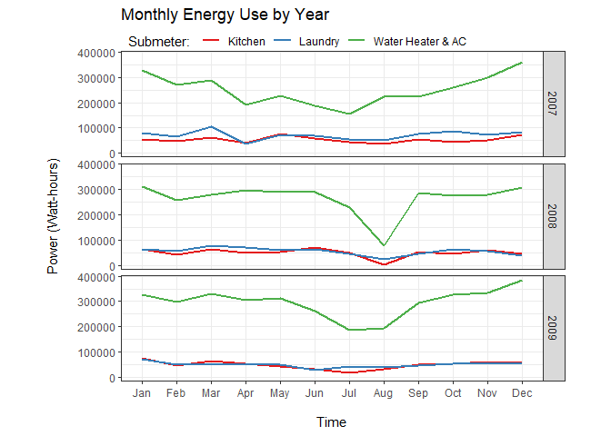
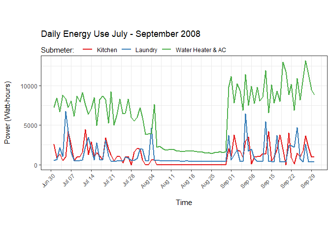
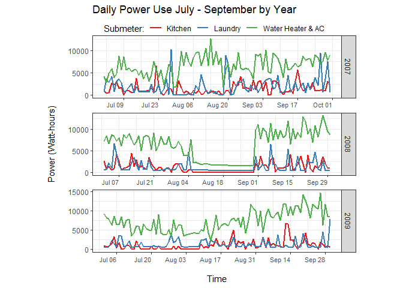
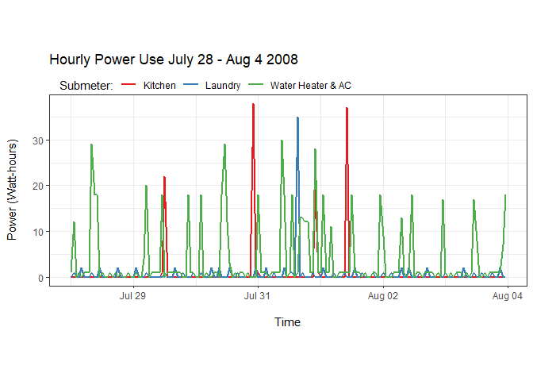
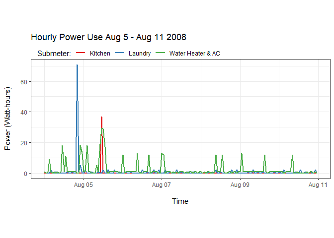
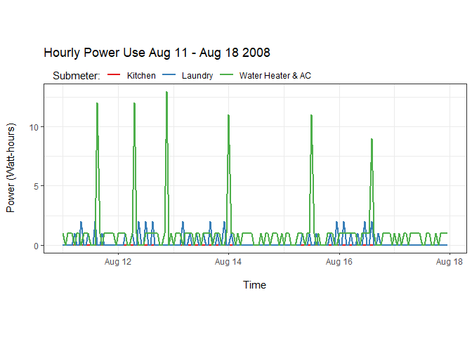
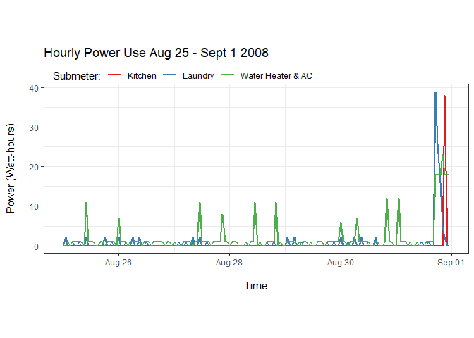
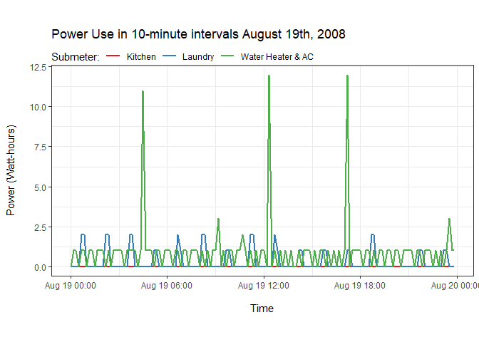
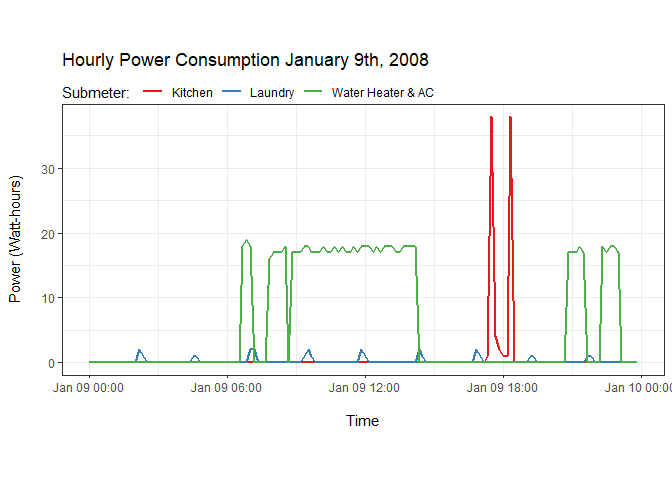

## Background
#### We have been asked by a law firm to conduct an in-depth analysis of power consumption data for a client's residential home. The law firm's client claims to have not been occupying a specific residence at the time of an undisclosed event during Summer of 2008. Energy use records will be used to provide evidence on whether or not residence was occupied from July-September 2008.

## Objective
#### Our objectives are to conduct an in-depth analysis of energy records from 2007 to 2010 for client residence and to answer the law firm's question, 'Was client residence occupied during the Summer of 2008?' We will achieve this by visualizing energy use patterns on high level (up to 3-years) to determine overall energy use patterns as well as a microscopic level during Summer of 2008.

## Data Description
#### Data consists of energy consumed per minute for 3 different sub-meters in residential home in Seaux, France between December 2006 and November 2010 (47 months). It contains over 2 million minute observations of electric power consumption. 

<table class="table table-striped table-hover" style="width: auto !important; margin-left: auto; margin-right: auto;">
 <thead>
  <tr>
   <th style="text-align:left;"> Column.Name </th>
   <th style="text-align:left;"> Description </th>
  </tr>
 </thead>
<tbody>
  <tr>
   <td style="text-align:left;"> Date </td>
   <td style="text-align:left;"> Date in format dd/mm/yyyy </td>
  </tr>
  <tr>
   <td style="text-align:left;"> Time </td>
   <td style="text-align:left;"> Time in format hh:mm:ss </td>
  </tr>
  <tr>
   <td style="text-align:left;"> Global_active_power </td>
   <td style="text-align:left;"> household global minute-averaged active power (kilowatt) </td>
  </tr>
  <tr>
   <td style="text-align:left;"> Global_reactive_power </td>
   <td style="text-align:left;"> household global minute-averaged reactive power (kilowatt) </td>
  </tr>
  <tr>
   <td style="text-align:left;"> Voltage </td>
   <td style="text-align:left;"> minute-averaged voltage (volt) </td>
  </tr>
  <tr>
   <td style="text-align:left;"> Global_intensity </td>
   <td style="text-align:left;"> household global minute-averaged current intensity (ampere) </td>
  </tr>
  <tr>
   <td style="text-align:left;"> Sub_metering_1 </td>
   <td style="text-align:left;"> watt-hour of active energy:  Kitchen </td>
  </tr>
  <tr>
   <td style="text-align:left;"> Sub_metering_2 </td>
   <td style="text-align:left;"> watt-hour of active energy:  Laundry </td>
  </tr>
  <tr>
   <td style="text-align:left;"> Sub_metering_3 </td>
   <td style="text-align:left;"> watt-hour of active energy:  Water heater &amp; AC </td>
  </tr>
</tbody>
</table>
#### Source: UCI Machine Learning Repository 'Individual household electric power consumption' data set

#### Submeter description:

  + Submeter 1: Kitchen (dishwasher, microwave, over)
  + Submeter 2: Laundry (washing machine, dryer, refridgerator, light)
  + Submeter 3: Electric water heater and air conditioner

## Load libraries

```r
library(RMySQL)
library(lubridate)
library(tidyverse)
library(openxlsx)
library(knitr)
library(ggplot2)
library(plotly)
library(ggthemes)
library(scales)
library(imputeTS)
```

## Load data

```r
# establish SQL connection
con = dbConnect(MySQL(), user = 'deepAnalytics',
                password='Sqltask1234!', dbname='dataanalytics2018',
                host = 'data-analytics-2018.cbrosir2cswx.us-east-1.rds.amazonaws.com')

## list tables in database
dbListTables(con)
```

```
## [1] "iris"    "yr_2006" "yr_2007" "yr_2008" "yr_2009" "yr_2010"
```

```r
## list attributes in 'yr_2006' table
dbListFields(con, 'yr_2006')
```

```
##  [1] "id"                    "Date"                  "Time"                 
##  [4] "Global_active_power"   "Global_reactive_power" "Global_intensity"     
##  [7] "Voltage"               "Sub_metering_1"        "Sub_metering_2"       
## [10] "Sub_metering_3"
```

```r
## Select attributes needed for analysis
yr_2006 <- dbGetQuery(con, 'SELECT Date, Time, Sub_metering_1, Sub_metering_2, Sub_metering_3 FROM yr_2006')
yr_2007 <- dbGetQuery(con, 'SELECT Date, Time, Sub_metering_1, Sub_metering_2, Sub_metering_3 FROM yr_2007')
yr_2008 <- dbGetQuery(con, 'SELECT Date, Time, Sub_metering_1, Sub_metering_2, Sub_metering_3 FROM yr_2008')
yr_2009 <- dbGetQuery(con, 'SELECT Date, Time, Sub_metering_1, Sub_metering_2, Sub_metering_3 FROM yr_2009')
yr_2010 <- dbGetQuery(con, 'SELECT Date, Time, Sub_metering_1, Sub_metering_2, Sub_metering_3 FROM yr_2010')
```

## Understand the data

```r
## check structure
str(yr_2006)  
str(yr_2007)  
str(yr_2008)   
str(yr_2009) 
str(yr_2010)  

## check head and tail
head(yr_2006) 
tail(yr_2006) # contains 2 weeks of data
head(yr_2007) 
tail(yr_2007) # contains 1 full year
head(yr_2008) 
tail(yr_2008) # contains 1 full year
head(yr_2009) 
tail(yr_2009) # contains 1 full year
head(yr_2010) 
tail(yr_2010) # contains 11 months
```

## Combine datasets

```r
## include only necessary years
subMeters <- bind_rows(yr_2007, yr_2008, yr_2009)

## check structure
str(subMeters)
```

```
## 'data.frame':	1569894 obs. of  5 variables:
##  $ Date          : chr  "2007-01-01" "2007-01-01" "2007-01-01" "2007-01-01" ...
##  $ Time          : chr  "00:00:00" "00:01:00" "00:02:00" "00:03:00" ...
##  $ Sub_metering_1: num  0 0 0 0 0 0 0 0 0 0 ...
##  $ Sub_metering_2: num  0 0 0 0 0 0 0 0 0 0 ...
##  $ Sub_metering_3: num  0 0 0 0 0 0 0 0 0 0 ...
```

```r
## check head and tail, ensuring dates are in correct order
head(subMeters)
```

```
##         Date     Time Sub_metering_1 Sub_metering_2 Sub_metering_3
## 1 2007-01-01 00:00:00              0              0              0
## 2 2007-01-01 00:01:00              0              0              0
## 3 2007-01-01 00:02:00              0              0              0
## 4 2007-01-01 00:03:00              0              0              0
## 5 2007-01-01 00:04:00              0              0              0
## 6 2007-01-01 00:05:00              0              0              0
```

```r
tail(subMeters)
```

```
##               Date     Time Sub_metering_1 Sub_metering_2 Sub_metering_3
## 1569889 2009-12-31 23:54:00              0              0             18
## 1569890 2009-12-31 23:55:00              0              0             18
## 1569891 2009-12-31 23:56:00              0              0             19
## 1569892 2009-12-31 23:57:00              0              0             18
## 1569893 2009-12-31 23:58:00              0              0             18
## 1569894 2009-12-31 23:59:00              0              0             19
```

## Preprocessing

```r
## combine Date and Time attributes into a new attribute column
subMeters <- cbind(subMeters, paste(subMeters$Date, subMeters$Time), stringsAsFactors = FALSE)

## change column name
colnames(subMeters)[6] <- 'DateTime'

## move DateTime closer to front of data frame
subMeters <- subMeters %>% relocate(DateTime, .before = Sub_metering_1)

## check structure
str(subMeters)
```

```
## 'data.frame':	1569894 obs. of  6 variables:
##  $ Date          : chr  "2007-01-01" "2007-01-01" "2007-01-01" "2007-01-01" ...
##  $ Time          : chr  "00:00:00" "00:01:00" "00:02:00" "00:03:00" ...
##  $ DateTime      : chr  "2007-01-01 00:00:00" "2007-01-01 00:01:00" "2007-01-01 00:02:00" "2007-01-01 00:03:00" ...
##  $ Sub_metering_1: num  0 0 0 0 0 0 0 0 0 0 ...
##  $ Sub_metering_2: num  0 0 0 0 0 0 0 0 0 0 ...
##  $ Sub_metering_3: num  0 0 0 0 0 0 0 0 0 0 ...
```

#### So far so good

## Date and Time manipulation

```r
## convert DateTime from character to POSIXct (number of seconds since January 1, 1970)
subMeters$DateTime <- as.POSIXct(subMeters$DateTime, '%Y/%m/%d %H:%M:%S')

## add time zone from France
attr(subMeters$DateTime, 'tzone') <- 'Europe/Paris'

## delete old Date and Time columns to create new ones columns with correct time zone
subMeters$Date <- NULL
subMeters$Time <- NULL

## Create new Date column with correct time zone
subMeters$Date <- date(subMeters$DateTime)
subMeters$Time <- format(subMeters$DateTime, '%H:%M:%S')

## check structure
str(subMeters)
```

```
## 'data.frame':	1569894 obs. of  6 variables:
##  $ DateTime      : POSIXct, format: "2007-01-01 01:00:00" "2007-01-01 01:01:00" ...
##  $ Sub_metering_1: num  0 0 0 0 0 0 0 0 0 0 ...
##  $ Sub_metering_2: num  0 0 0 0 0 0 0 0 0 0 ...
##  $ Sub_metering_3: num  0 0 0 0 0 0 0 0 0 0 ...
##  $ Date          : Date, format: "2007-01-01" "2007-01-01" ...
##  $ Time          : chr  "01:00:00" "01:01:00" "01:02:00" "01:03:00" ...
```

```r
## move Date and Time to more strategic location
subMeters <- subMeters %>% relocate(Date, .before = Sub_metering_1)
subMeters <- subMeters %>% relocate(Time, .before = Sub_metering_1)

## change name of certain columns
subMeters <- subMeters %>% rename(sub1 = Sub_metering_1)
subMeters <- subMeters %>% rename(sub2 = Sub_metering_2)
subMeters <- subMeters %>% rename(sub3 = Sub_metering_3)

## lubridate to create new attributes from 'DateTime' for analysis
subMeters$year <- year(subMeters$DateTime)
subMeters$quarter <- quarter(subMeters$DateTime)
subMeters$month <- month(subMeters$DateTime)
subMeters$week <- isoweek(subMeters$DateTime)
subMeters$wday <- wday(subMeters$DateTime)
subMeters$day <- day(subMeters$DateTime)
subMeters$hour <- hour(subMeters$DateTime)
subMeters$minute <- minute(subMeters$DateTime)

## move Date and Time to more strategic location
subMeters <- subMeters %>% relocate(sub1, .after = minute)
subMeters <- subMeters %>% relocate(sub2, .after = sub1)
subMeters <- subMeters %>% relocate(sub3, .after = sub2)

## check structure
str(subMeters)
```

```
## 'data.frame':	1569894 obs. of  14 variables:
##  $ DateTime: POSIXct, format: "2007-01-01 01:00:00" "2007-01-01 01:01:00" ...
##  $ Date    : Date, format: "2007-01-01" "2007-01-01" ...
##  $ Time    : chr  "01:00:00" "01:01:00" "01:02:00" "01:03:00" ...
##  $ year    : num  2007 2007 2007 2007 2007 ...
##  $ quarter : int  1 1 1 1 1 1 1 1 1 1 ...
##  $ month   : num  1 1 1 1 1 1 1 1 1 1 ...
##  $ week    : num  1 1 1 1 1 1 1 1 1 1 ...
##  $ wday    : num  2 2 2 2 2 2 2 2 2 2 ...
##  $ day     : int  1 1 1 1 1 1 1 1 1 1 ...
##  $ hour    : int  1 1 1 1 1 1 1 1 1 1 ...
##  $ minute  : int  0 1 2 3 4 5 6 7 8 9 ...
##  $ sub1    : num  0 0 0 0 0 0 0 0 0 0 ...
##  $ sub2    : num  0 0 0 0 0 0 0 0 0 0 ...
##  $ sub3    : num  0 0 0 0 0 0 0 0 0 0 ...
```
#### All looks good

## Check for missing data

```r
## group by date, obtain the count, and turn into data frame
missing_datetime <- subMeters %>% count(Date)
incomplete_data <- data.frame(table(missing_datetime$n))
incomplete_data
```

```
##    Var1 Freq
## 1    60    1
## 2   141    1
## 3   150    1
## 4   456    1
## 5   549    1
## 6   865    1
## 7  1310    1
## 8  1370    1
## 9  1379    1
## 10 1380    3
## 11 1397    1
## 12 1402    2
## 13 1416    1
## 14 1419    1
## 15 1434    1
## 16 1436    1
## 17 1437    1
## 18 1438   12
## 19 1439   25
## 20 1440 1035
## 21 1500    3
```


```r
## filter for all days that do not have 1440 hours
missing_time <- missing_datetime %>% filter(n !=1440) 
missing_time
```

```
##          Date    n
## 1  2007-01-01 1380
## 2  2007-01-14 1439
## 3  2007-01-28 1439
## 4  2007-02-22 1438
## 5  2007-03-25 1379
## 6  2007-04-28  141
## 7  2007-04-30  456
## 8  2007-06-01 1439
## 9  2007-06-06 1439
## 10 2007-06-09 1402
## 11 2007-06-19 1438
## 12 2007-06-29 1439
## 13 2007-07-15 1310
## 14 2007-07-22 1439
## 15 2007-08-01 1419
## 16 2007-08-24 1439
## 17 2007-09-26 1438
## 18 2007-10-23 1438
## 19 2007-10-28 1500
## 20 2007-11-21 1439
## 21 2007-11-29 1439
## 22 2007-12-17 1439
## 23 2008-01-13 1439
## 24 2008-02-02 1439
## 25 2008-02-23 1438
## 26 2008-03-24 1439
## 27 2008-03-30 1380
## 28 2008-05-16 1438
## 29 2008-06-13 1439
## 30 2008-07-13 1438
## 31 2008-08-04 1439
## 32 2008-08-31 1439
## 33 2008-10-25 1397
## 34 2008-10-26 1500
## 35 2008-11-10 1434
## 36 2008-11-12 1438
## 37 2008-11-23 1439
## 38 2008-12-10 1370
## 39 2008-12-20 1439
## 40 2009-01-14 1439
## 41 2009-02-01 1402
## 42 2009-02-14 1438
## 43 2009-02-17 1416
## 44 2009-03-01 1439
## 45 2009-03-16 1439
## 46 2009-03-29 1380
## 47 2009-04-13 1438
## 48 2009-05-10 1439
## 49 2009-05-26 1437
## 50 2009-06-13  150
## 51 2009-06-15  865
## 52 2009-07-11 1436
## 53 2009-08-13  549
## 54 2009-09-13 1439
## 55 2009-09-30 1438
## 56 2009-10-11 1439
## 57 2009-10-25 1500
## 58 2009-11-09 1439
## 59 2009-12-10 1438
## 60 2010-01-01   60
```

### Observations: Out of 60 dates not at 1440 total minutes/day, 3 dates contain 1500 minutes, and 57 dates have <1440 minutes/day. 25 days are missing 1 minute, and 15 days are missing 2-5 minutes. During time period of concern (July-Sept 2008), only 4 total minutes are missing on 3 separate days. Due to insignificant number of missing minutes during primary time focus, missing values were not imputed in dataset.

## Initial EDA for 2007-2010 data

```r
### Viewing summary statistics
sum(subMeters$sub1) # 1,819,989 total kilowatts used
```

```
## [1] 1819989
```

```r
sum(subMeters$sub2) # 2,108,410 total kilowatts used
```

```
## [1] 2108410
```

```r
sum(subMeters$sub3) # 9.758,843 total kilowatts used
```

```
## [1] 9758843
```

```r
summary(subMeters)
```

```
##     DateTime                        Date                Time          
##  Min.   :2007-01-01 01:00:00   Min.   :2007-01-01   Length:1569894    
##  1st Qu.:2007-10-03 08:39:15   1st Qu.:2007-10-03   Class :character  
##  Median :2008-07-01 22:05:30   Median :2008-07-01   Mode  :character  
##  Mean   :2008-07-02 03:54:14   Mean   :2008-07-01                     
##  3rd Qu.:2009-03-31 14:32:45   3rd Qu.:2009-03-31                     
##  Max.   :2010-01-01 00:59:00   Max.   :2010-01-01                     
##       year         quarter         month             week            wday  
##  Min.   :2007   Min.   :1.00   Min.   : 1.000   Min.   : 1.00   Min.   :1  
##  1st Qu.:2007   1st Qu.:2.00   1st Qu.: 4.000   1st Qu.:13.00   1st Qu.:2  
##  Median :2008   Median :3.00   Median : 7.000   Median :27.00   Median :4  
##  Mean   :2008   Mean   :2.51   Mean   : 6.529   Mean   :26.62   Mean   :4  
##  3rd Qu.:2009   3rd Qu.:4.00   3rd Qu.:10.000   3rd Qu.:40.00   3rd Qu.:6  
##  Max.   :2010   Max.   :4.00   Max.   :12.000   Max.   :53.00   Max.   :7  
##       day             hour          minute           sub1       
##  Min.   : 1.00   Min.   : 0.0   Min.   : 0.00   Min.   : 0.000  
##  1st Qu.: 8.00   1st Qu.: 5.0   1st Qu.:14.25   1st Qu.: 0.000  
##  Median :16.00   Median :12.0   Median :30.00   Median : 0.000  
##  Mean   :15.71   Mean   :11.5   Mean   :29.50   Mean   : 1.159  
##  3rd Qu.:23.00   3rd Qu.:18.0   3rd Qu.:44.00   3rd Qu.: 0.000  
##  Max.   :31.00   Max.   :23.0   Max.   :59.00   Max.   :82.000  
##       sub2             sub3       
##  Min.   : 0.000   Min.   : 0.000  
##  1st Qu.: 0.000   1st Qu.: 0.000  
##  Median : 0.000   Median : 1.000  
##  Mean   : 1.343   Mean   : 6.216  
##  3rd Qu.: 1.000   3rd Qu.:17.000  
##  Max.   :78.000   Max.   :31.000
```
### Summary of Energy Use by Submeter from 2007 to 2010: 

* Sub-meter 1: Kitchen
  + Least total energy used (1,819,989 Watts)
  + Average 1.16 Watts per minute
  + Largest energy range (0-82 Watts)
* Sub-meter 2: Laundry
  + Total energy used (2,108,410 Watts)
  + Average 1.34 Watts per minute
  + Energy range (0-78 Watts)
* Sub-meter 3: Water Heater & AC
  + Most total energy used (9,758,843 Watts)
  + Average 6.21 Watts per minute
  + Smallest energy range (0-32 Watts)

## Data Transformation for In-depth EDA

```r
## summarizing in groups by year, quarter, month, week, day
QtrlySum <- subMeters %>%
  group_by(year, quarter) %>% 
  summarise(across(starts_with('sub'), sum))

QtrlySumGather <- gather(QtrlySum, 'sub1', 'sub2', 'sub3',
                         key = 'submeter', value = 'amount')

MonthlySum <- subMeters %>%
  group_by(year, month) %>% 
  summarise(across(starts_with('sub'), sum))

MonthSumGather <- gather(MonthlySum, 'sub1', 'sub2', 'sub3',
                         key = 'submeter', value = 'amount')

DailySum <- subMeters %>%
  group_by(Date, year, quarter, day) %>% 
  summarise(across(starts_with('sub'), sum))

DailySumGather <- gather(DailySum, 'sub1', 'sub2', 'sub3',
                         key = 'submeter', value = 'amount')

HourlySum <- subMeters %>% 
  group_by(Date, month, week, day, hour) %>% 
  summarise(across(starts_with('sub'), sum))

HourlySumGather <- gather(HourlySum, 'sub1', 'sub2', 'sub3',
                          key = 'submeter', value = 'amount')


AllSumGathered <- gather(subMeters, 'sub1', 'sub2', 'sub3',
                         key = 'submeter', value = 'amount')
```


## EDA
### Exploring monthly energy use patterns by year

```r
## Monthly Sum by Year
subset(MonthSumGather, year != 2010) %>%
  ggplot(aes(month, amount, color=submeter)) +
  geom_line(size = 1) +
  facet_grid(year~.) +
  theme_bw() +
  theme(aspect.ratio = .25,
        legend.position = 'top',
        legend.justification = 'left',
        legend.margin=margin(0,0,0,6),
        legend.box.margin=margin(0,-10,-10,0)) +
  scale_color_brewer(palette = 'Set1', name = 'Submeter: ', labels = c('Kitchen', 'Laundry', 'Water Heater & AC')) +
  scale_x_discrete(limits=c('Jan','Feb','Mar','Apr','May','Jun','Jul','Aug','Sep','Oct','Nov','Dec')) +
  scale_y_continuous(labels = function(x) format(x, scientific = FALSE)) +
  xlab('\nTime') +
  ylab('Power (Watt-hours)\n') +
  ggtitle('Monthly Energy Use by Year')
```

<!-- -->

### Observations

* Water heater and AC consistently use more energy than other submeters across years
* Seasonal patterns show peak energy use for Water Heater & AC in winter months, with steady decline reaching lows in summer months
* Sharp decline for all submeters seen in August 2008

### Exploring Summer 2008 dip

```r
## Daily Sum by Month in Summer 2008
subset(DailySumGather, year==2008 & quarter == 3) %>%
  ggplot(aes(Date, amount, color=submeter)) +
  geom_line(size = 1) +
  theme_bw() +
  theme(aspect.ratio = .4,
        legend.position = 'top',
        legend.justification = 'left',
        legend.margin=margin(2,0,0,0),
        legend.box.margin=margin(0,-10,-10,0)) +
  scale_color_brewer(palette = 'Set1', name = 'Submeter:  ', labels = c('Kitchen', 'Laundry', 'Water Heater & AC')) +
  scale_x_date(labels = date_format('%b %d'), breaks = date_breaks('1 week')) +
  theme(axis.text.x = element_text(angle = 45, hjust = 1, vjust = 1, size = 8)) +
  xlab('\nTime') +
  ylab('Power (Watt-hours)\n') +
  ggtitle('Daily Energy Use July - September 2008')
```

<!-- -->

### Observations:

* Notice steep drop in energy use in all submeters from Aug 5-29, 2008
* Water Heater & AC consistently use more energy than other submeters, even during August time period

### Comparing summer across years to see if 2008 is pattern or anomaly

```r
## Daily Sum each Summer by year
subset(DailySumGather, quarter==3) %>%
  ggplot(aes(Date, amount, color=submeter)) +
  geom_line(size = .8) +
  facet_wrap(~year, scales = 'free', nrow = 3, strip.position = 'right') +
  theme_bw() +
  theme(aspect.ratio = .25,
        legend.position = 'top',
        legend.justification = 'left',
        legend.margin=margin(2,0,0,4),
        legend.box.margin=margin(0,-10,-10,10)) +
  scale_color_brewer(palette = 'Set1', name = 'Submeter:', labels = c('Kitchen', 'Laundry', 'Water Heater & AC')) +
  scale_x_date(labels = date_format('%b %d'), breaks = date_breaks('2 weeks')) +
  theme(axis.text.x = element_text(hjust = 1, vjust = 1, size = 8)) +
  xlab('\nTime') +
  ylab('Power (Watt-hours)\n') +
  ggtitle('Daily Power Use July - September by Year')
```

<!-- -->

### Observations:

* Steep, extended drop in energy use is seen in August 2008 only
* Water heater & AC consistently use more energy than other submeters across years
* Less steep drop is seen for short duration beginning of August 2009, but only for few days


### Investigating energy use on microscopic level each week and within days in August 2008

```r
## create hourly use by week 31 in 2008 (July 28 - August 4)
houseWeek31 <- data.frame(filter(AllSumGathered, year==2008 & week==31 & minute==0))


## hourly Sum by Week
houseWeek31 %>%
  ggplot(aes(DateTime, amount, color=submeter)) +
  geom_line(size = .8) +
  theme_bw() +
  theme(aspect.ratio = .4,
        legend.position = 'top',
        legend.justification = 'left',
        legend.margin=margin(2,0,0,0),
        legend.box.margin=margin(0,-10,-10,10)) +
  scale_color_brewer(palette = 'Set1', name = 'Submeter:', labels = c('Kitchen', 'Laundry', 'Water Heater & AC')) +
  xlab('\nTime') +
  ylab('Power (Watt-hours)\n') +
  ggtitle('Hourly Power Use July 28 - Aug 4 2008')
```

<!-- -->

### Observations:

* Kitchen: used 4 times in 1 week period, 19-37 Watts/time
* Laundry: 1 higher use of 35 Watts July 31, otherwise 2-3 Watts used at regular intervals
* Water Heater & AC: Range of 2-30 Watts used more frequently throughout the week

### Let's explore hourly use the following week. We will do this throughout the rest of August to determine energy use and occupancy status of residence. 

```r
## create hourly use by week 32 in 2008 (August 4-11)
houseWeek32 <- data.frame(filter(AllSumGathered, year==2008 & week==32 & minute==0))


## hourly Sum by Week
houseWeek32 %>%
  ggplot(aes(DateTime, amount, color=submeter)) +
  geom_line(size = .8) +
  theme_bw() +
  theme(aspect.ratio = .4,
        legend.position = 'top',
        legend.justification = 'left',
        legend.margin=margin(2,0,0,0),
        legend.box.margin=margin(0,-10,-10,10)) +
  scale_color_brewer(palette = 'Set1', name = 'Submeter:', labels = c('Kitchen', 'Laundry', 'Water Heater & AC')) +
  xlab('\nTime') +
  ylab('Power (Watt-hours)\n') +
  ggtitle('Hourly Power Use Aug 5 - Aug 11 2008')
```

<!-- -->

### Observations:

* Noticeable different in energy use August 5th on.
* Kitchen: reveals 1 spike of 39 Watts on Aug 5, with no more use
* Laundry: 1 spike of 71 Watts late Aug 4. We can see 2-3 Watt intervals rest of week.
* Water heater & AC: High of 30 Watts occurred on Aug 5, followed by 1-2 Watt regular intervals with 12 Watt spikes about once/day.

### Investigating hourly use the following week in August

```r
## create hourly use by week 33 in 2008 (August 11-18)
houseWeek33 <- data.frame(filter(AllSumGathered, year==2008 & week==33 & minute==0))


## hourly Sum by Week
houseWeek33 %>%
  ggplot(aes(DateTime, amount, color=submeter)) +
  geom_line(size = .8) +
  theme_bw() +
  theme(aspect.ratio = .4,
        legend.position = 'top',
        legend.justification = 'left',
        legend.margin=margin(2,0,0,0),
        legend.box.margin=margin(0,-10,-10,10)) +
  scale_color_brewer(palette = 'Set1', name = 'Submeter:', labels = c('Kitchen', 'Laundry', 'Water Heater & AC')) +
  xlab('\nTime') +
  ylab('Power (Watt-hours)\n') +
  ggtitle('Hourly Power Use Aug 11 - Aug 18 2008')
```

<!-- -->

### Observations:

* Kitchen: No energy use during this time frame
* Laundry: 1-2 Watt daily intervals, however, also notice time periods of seemingly no energy use
* Water heater & AC: 1-Watt regular intervals with 12-Watt spikes about once/day.

### Again, we will investigate hourly use the following week

```r
## create hourly use by week 34 in 2008 (August 18-25)
houseWeek34 <- data.frame(filter(AllSumGathered, year==2008 & week==34 & minute==0))


## hourly Sum by Week
houseWeek34 %>%
  ggplot(aes(DateTime, amount, color=submeter)) +
  geom_line(size = .8) +
  theme_bw() +
  theme(aspect.ratio = .4,
        legend.position = 'top',
        legend.justification = 'left',
        legend.margin=margin(2,0,0,0),
        legend.box.margin=margin(0,-10,-10,10)) +
  scale_color_brewer(palette = 'Set1', name = 'Submeter:', labels = c('Kitchen', 'Laundry', 'Water Heater & AC')) +
  xlab('\nTime') +
  ylab('Power (Watt-hours)\n') +
  ggtitle('Hourly Power Use Aug 18 - 25 2008')
```

<!-- -->

### Observations:

* Kitchen: No energy use
* Laundry: Appears to be no energy used Aug 19, but used other days
* Water heater & AC: 1 Watt regular daily intervals, with some spikes

### Explore one more week in August, then investigate hourly use on August 19th to see if Laundry was in use or not.

```r
## create hourly use by week 35 in 2008 (August 25-Sept 1)
houseWeek35 <- data.frame(filter(AllSumGathered, year==2008 & week==35 & minute==0))


## hourly Sum by Week
houseWeek35 %>%
  ggplot(aes(DateTime, amount, color=submeter)) +
  geom_line(size = .8) +
  theme_bw() +
  theme(aspect.ratio = .4,
        legend.position = 'top',
        legend.justification = 'left',
        legend.margin=margin(2,0,0,0),
        legend.box.margin=margin(0,-10,-10,10)) +
  scale_color_brewer(palette = 'Set1', name = 'Submeter:', labels = c('Kitchen', 'Laundry', 'Water Heater & AC')) +
  xlab('\nTime') +
  ylab('Power (Watt-hours)\n') +
  ggtitle('Hourly Power Use Aug 25 - Sept 1 2008')
```

<!-- -->

### Observations:

* Kitchen: No use until September 1, 2008
* Laundry and Water heater/AC: Similar pattern from prior week

### Now, let's observe energy use in 10-minute intervals on August 19th to see if in fact Laundry submeter is used

```r
## create 10-minute interval use for one day within time period in question
houseDay19 <- data.frame(filter(AllSumGathered, year==2008 & month==8 & day==19 & (minute==0 | minute==10 | minute==20 | minute==30 | minute==40 | minute==50)))

houseDay19 %>% 
  ggplot(aes(DateTime, amount, color=submeter)) +
  geom_line(size=.8) +
  theme_bw() +
  theme(aspect.ratio = .5,
        legend.position = 'top',
        legend.justification = 'left',
        legend.margin=margin(2,0,0,0),
        legend.box.margin=margin(0,-10,-10,0)) +
  scale_color_brewer(palette = 'Set1', name = 'Submeter:', labels = c('Kitchen', 'Laundry', 'Water Heater & AC')) +
  xlab('\nTime') +
  ylab('Power (Watt-hours)\n') +
  ggtitle('Power Use in 10-minute intervals August 19th, 2008')
```

<!-- -->

### Observations:

* Reveals laundry is in use, but low 1-2 Watts, same as other days in August. Fridge is connected to laundry submeter, which can easily explain low use at regular intervals
* Kitchen is not used

### We will compare this day to another day outside of time period in question to compare differences


```r
## create 10 minute interval use for one day outside of time period in question
houseDay9 <- data.frame(filter(AllSumGathered, year==2008 & month==1 & day==9 & (minute==0 | minute==10 | minute==20 | minute==30 | minute==40 | minute==50)))

houseDay9 %>%  
  ggplot(aes(DateTime, amount, color=submeter)) +
  geom_line(size=.8) +
  theme_bw() +
  theme(aspect.ratio = .45,
      legend.position = 'top',
      legend.justification = 'left',
      legend.margin=margin(2,0,0,0),
      legend.box.margin=margin(0,-10,-10,0)) +
  scale_color_brewer(palette = 'Set1', name = 'Submeter: ', labels = c('Kitchen', 'Laundry', 'Water Heater & AC')) +
  xlab('\nTime') +
  ylab('Power (Watt-hours)\n') +
  ggtitle('Hourly Power Consumption January 9th, 2008')
```

<!-- -->

### Observation:

* Kitchen is in use during dinner time frame
* Laundry has same 1-2 Watt pattern as Aug 18, 2008
* Water heater & AC is in much higher use throughout the day

# Summary and Conclusion:
### Seasonal use patterns reveal peak energy use in winter and low in summer months, with water heater & AC consistently using more across time

### There was a sharp, extended decline for all sub-meters seen from Aug 5th - 31st, 2008

* This decline is atypical of all other time periods
* No energy was used from kitchen submeter from Aug 6th - 31st, 2008
* Lower energy use than typically seen in summer from both Laundry and Water Heater/AC submeters

### Recommendation based on evidence from data is that residence was not occupied from August 6th - August 31st, 2008, but was occupied all other days within July-September 2008 time frame. 


